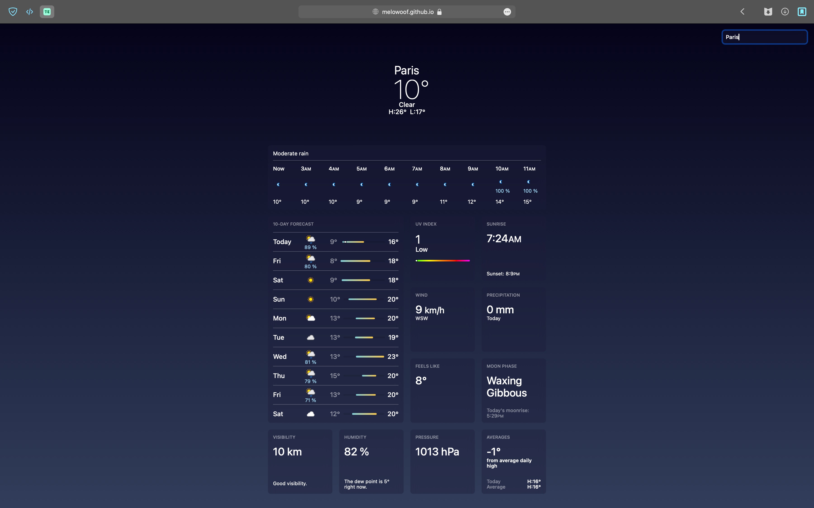

# odin-weather-app

Weather App project for The Odin Project's curriculum - on the topic of learning fetch(), APIs, asynchronous code, and async/await.

Preview link: https://melowoof.github.io/odin-weather-app/

Design from: Apple's Weather App

Built with: 
Vite
WeatherAPI
JavaScript
HTML
CSS